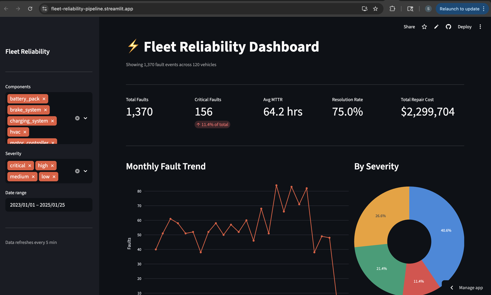
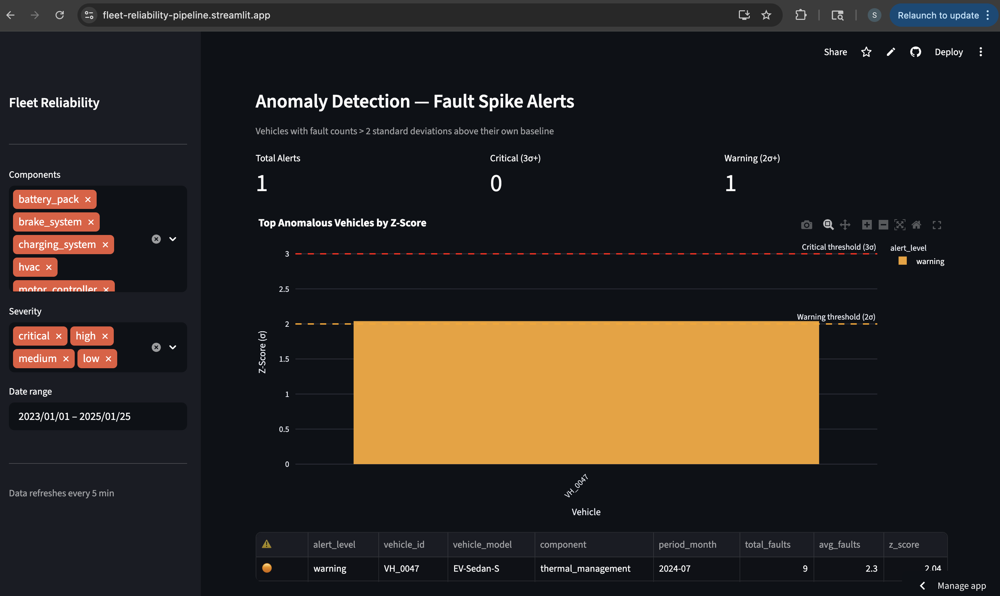
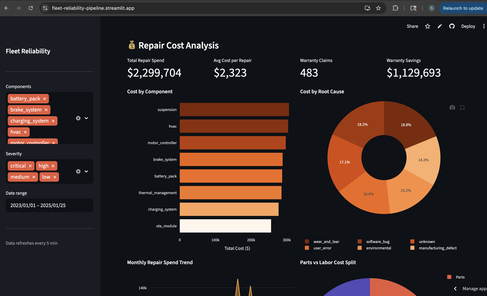
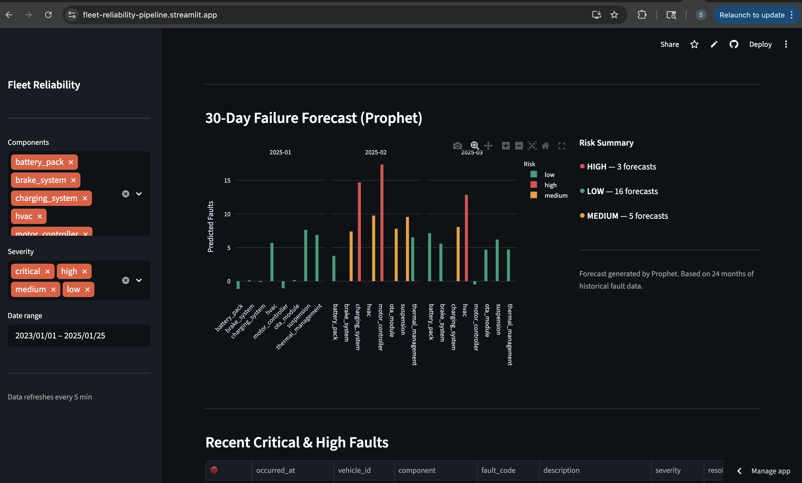
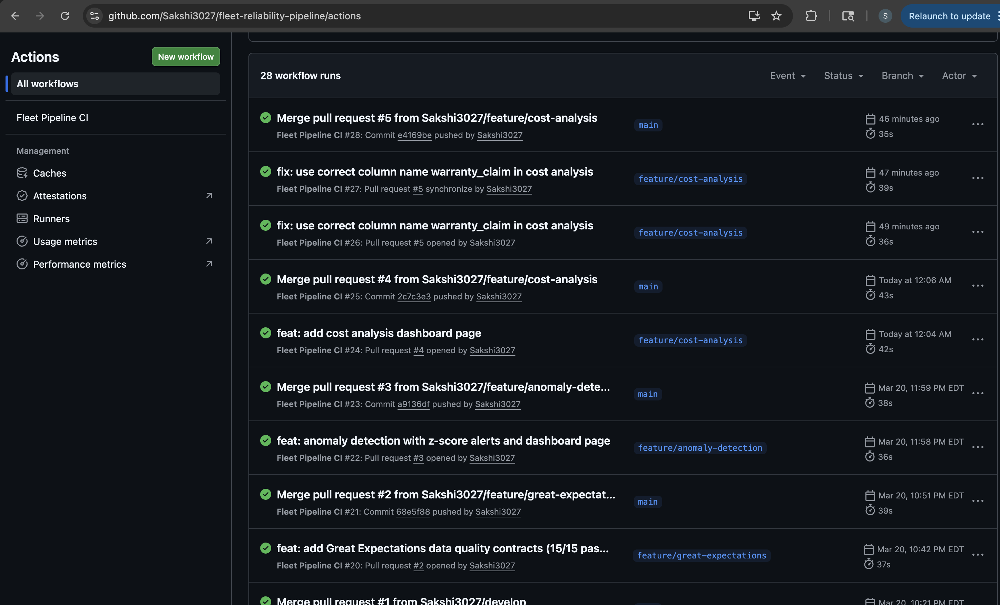

# Fleet Reliability Pipeline


An end-to-end EV fleet reliability data engineering project simulating the kind of
infrastructure used at companies like Tesla, Rivian, and Lucid.

## Live Dashboard

**[fleet-reliability-pipeline.streamlit.app](https://fleet-reliability-pipeline.streamlit.app)**

> Live EV fleet reliability dashboard powered by Supabase + Streamlit Cloud

---

## Screenshots

### Live Dashboard


### dbt Data Lineage


### Anomaly Detection


### Cost Analysis


### Prophet Forecast


### CI/CD — All Green


---

## Architecture
```
Raw Data (CSV/JSON)
    → Incremental Ingest (Python + psycopg2 + watermarks)
    → Data Quality Contracts (Great Expectations — 15 checks)
    → dbt Transforms (staging → intermediate → marts)
    → Orchestration (Apache Airflow DAG — daily schedule)
    → Forecast (Prophet — 30-day failure risk per component)
    → Anomaly Detection (Z-score spike alerts)
    → Dashboard (Streamlit + Plotly — live on Supabase)
```

---

## Tech Stack

| Layer | Technology |
|---|---|
| Data generation | Python, Faker |
| Ingestion | Python, psycopg2, watermarks, dead letter queue |
| Storage | PostgreSQL 15 (Docker + Supabase cloud) |
| Transformation | dbt (10 models, 37 tests, lineage graph) |
| Quality checks | Great Expectations (15 data contracts) |
| Orchestration | Apache Airflow 2.9 |
| Forecasting | Prophet (Meta), scikit-learn |
| Anomaly detection | Z-score dbt model (2σ threshold) |
| Dashboard | Streamlit, Plotly |
| CI/CD | GitHub Actions (branch protection + PR workflow) |
| Containerisation | Docker Compose |
| Cloud DB | Supabase (PostgreSQL) |
| Deployment | Streamlit Cloud |

---

## Dataset

Mock EV fleet data across 120 vehicles, 2 years:

- `vehicles.csv` — 120 vehicles (4 EV models, 5 fleets)
- `fault_codes.csv` — 1,300+ OBD-II fault events (8 components)
- `repair_logs.json` — 990 repair records with MTTR and cost
- `vehicle_telemetry.csv` — 12,600 weekly sensor snapshots

---

## Key Features

**ETL Pipeline**
- Incremental loads with watermark tracking — no full reloads
- Dead letter queue — bad records captured, pipeline never crashes
- Custom data quality checks + Great Expectations contracts

**dbt Data Models**
- 3-layer architecture: staging → intermediate → marts
- 10 models, 37 data tests, auto-generated lineage graph
- Window functions, aggregations, CTEs

**Forecasting**
- Prophet time-series model per component
- 30-day failure likelihood with 80% confidence intervals
- Risk tiers: high / medium / low

**Anomaly Detection**
- Z-score model flags vehicles 2+ standard deviations above baseline
- Critical (3σ) and warning (2σ) alert levels
- Per-vehicle, per-component monthly analysis

**Dashboard**
- KPI cards: total faults, critical count, avg MTTR, resolution rate, repair cost
- Monthly fault trend, severity breakdown, MTTR by component
- Battery SOH degradation with 80% threshold alert
- Prophet 30-day forecast with risk tiers
- Anomaly detection alerts with z-score table
- Cost analysis: $2.3M spend by component, root cause, service center
- Parts vs labor split, warranty savings tracking
- Sidebar filters: component, severity, date range

---

## Quick Start

### Prerequisites
- Docker Desktop running
- Python 3.12, conda

### Setup
```bash
# 1. Clone the repo
git clone https://github.com/Sakshi3027/fleet-reliability-pipeline.git
cd fleet-reliability-pipeline

# 2. Create environment
conda create -n fleet-env python=3.12 -y
conda activate fleet-env
pip install -r requirements.txt

# 3. Start PostgreSQL
docker-compose up -d

# 4. Generate mock data
python data/generate_mock_data.py

# 5. Run the full ETL pipeline
python etl/ingest.py
python etl/clean.py
python etl/transform.py

# 6. Run dbt transforms
cd dbt/fleet_dbt && dbt run && dbt test && cd ../..

# 7. Run data quality contracts
python expectations/fleet_expectations.py

# 8. Run the forecast model
python models/failure_forecast.py

# 9. Launch the dashboard
streamlit run dashboard/app.py
```

Open `http://localhost:8501` in your browser.

### Run tests
```bash
# pytest unit tests
pytest tests/ -v

# dbt data tests
cd dbt/fleet_dbt && dbt test

# Great Expectations contracts
python expectations/fleet_expectations.py
```

### Run Airflow DAG
```bash
export AIRFLOW_HOME=$(pwd)/airflow
airflow db init
airflow dags test fleet_reliability_pipeline 2024-01-01
```

### Run incremental load
```bash
# Only processes records newer than last watermark
python etl/ingest_incremental.py
```

---

## Project Structure
```
fleet-reliability-pipeline/
├── data/
│   ├── generate_mock_data.py      # Mock EV data generator
│   └── raw/                       # Generated CSV/JSON files
├── etl/
│   ├── ingest.py                  # Full load → PostgreSQL
│   ├── ingest_incremental.py      # Incremental load + watermarks
│   ├── clean.py                   # Data quality checks
│   └── transform.py               # SQL → mart tables
├── dbt/fleet_dbt/
│   ├── models/staging/            # Clean + rename raw tables
│   ├── models/intermediate/       # Business logic joins
│   └── models/marts/              # Final KPI tables
├── dags/
│   └── fleet_pipeline_dag.py      # Airflow DAG (daily schedule)
├── db/migrations/                 # PostgreSQL schema SQL
├── expectations/
│   └── fleet_expectations.py      # Great Expectations suite
├── models/
│   └── failure_forecast.py        # Prophet forecasting model
├── dashboard/
│   ├── app.py                     # Local Streamlit dashboard
│   └── app_cloud.py               # Cloud Streamlit dashboard
├── docs/screenshots/              # Project screenshots
├── scripts/                       # Utility scripts
├── tests/
│   └── test_etl.py                # pytest unit tests (11 tests)
├── docker-compose.yml             # PostgreSQL container
├── CONTRIBUTING.md                # Contribution guide
└── .github/workflows/ci.yml       # GitHub Actions CI
```

---

## Quality Summary

| Check | Result |
|---|---|
| pytest unit tests | 11/11 passing |
| dbt data tests | 37/37 passing |
| Great Expectations contracts | 15/15 passing |
| GitHub Actions CI runs | All green |

---

## Live Demo

🌐 Dashboard: https://fleet-reliability-pipeline.streamlit.app

📝 Article: https://medium.com/@SakshiChavan/how-i-built-a-production-grade-ev-fleet-reliability-pipeline-and-what-i-learned-1b5c1a4a41de