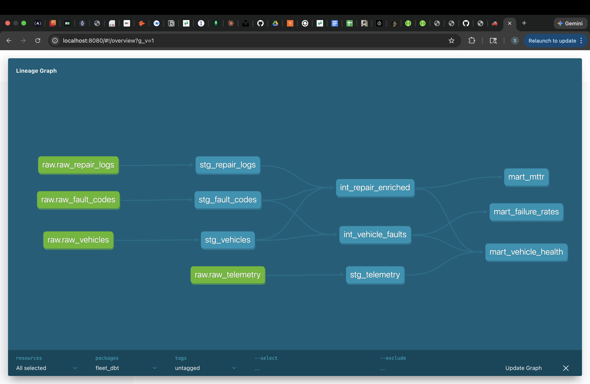

# Fleet Reliability Pipeline

An end-to-end EV fleet data engineering project simulating the kind of
reliability infrastructure used at companies like Tesla, Rivian, and Lucid.

## Architecture
```
Raw Data (CSV/JSON)
    → Ingest (Python + psycopg2)
    → Quality Checks (custom validators)
    → Transform (SQL aggregations → mart tables)
    → Orchestration (Apache Airflow DAG)
    → Forecast (Prophet time-series model)
    → Dashboard (Streamlit + Plotly)
```
## Data Lineage

The full data lineage graph, auto-generated by dbt:



Raw sources (green) flow through staging views → intermediate joins → mart tables (served to dashboard).

## Tech Stack

| Layer | Technology |
|---|---|
| Data generation | Python, Faker |
| Ingestion | Pandas, psycopg2 |
| Storage | PostgreSQL 15 (Docker) |
| Transformation | SQL (window functions, aggregations) |
| Quality checks | Custom validators |
| Orchestration | Apache Airflow 2.9 |
| Forecasting | Prophet (Meta), scikit-learn |
| Dashboard | Streamlit, Plotly |
| CI/CD | GitHub Actions |
| Containerisation | Docker Compose |

## Dataset

Mock EV fleet data across 120 vehicles, 2 years:

- `vehicles.csv` — 120 vehicles (4 EV models, 5 fleets)
- `fault_codes.csv` — 1,300+ OBD-II fault events (8 components)
- `repair_logs.json` — 990 repair records with MTTR and cost
- `vehicle_telemetry.csv` — 12,600 weekly sensor snapshots

## Key Metrics

- **MTTR** (Mean Time To Repair) by component and severity
- **Failure rate** (% unresolved faults) by vehicle and component
- **Battery SOH** (State of Health) degradation over time
- **30-day failure forecast** per component using Prophet

## Quick Start

### Prerequisites
- Docker Desktop running
- Python 3.12, conda

### Setup
```bash
# 1. Clone the repo
git clone https://github.com/YOUR_USERNAME/fleet-reliability-pipeline.git
cd fleet-reliability-pipeline

# 2. Create environment
conda create -n fleet-env python=3.12 -y
conda activate fleet-env
pip install -r requirements.txt

# 3. Start PostgreSQL
docker-compose up -d

# 4. Generate mock data
python data/generate_mock_data.py

# 5. Run the full ETL pipeline
python etl/ingest.py
python etl/clean.py
python etl/transform.py

# 6. Run the forecast model
python models/failure_forecast.py

# 7. Launch the dashboard
streamlit run dashboard/app.py
```

Open `http://localhost:8501` in your browser.

### Run tests
```bash
pytest tests/ -v
```

### Run Airflow DAG
```bash
export AIRFLOW_HOME=$(pwd)/airflow
airflow db init
airflow dags test fleet_reliability_pipeline 2024-01-01
```

## Project Structure
```
fleet-reliability-pipeline/
├── data/
│   ├── generate_mock_data.py   # Mock EV data generator
│   └── raw/                    # Generated CSV/JSON files
├── etl/
│   ├── ingest.py               # Load raw files → PostgreSQL
│   ├── clean.py                # Data quality checks
│   └── transform.py            # SQL → mart tables
├── dags/
│   └── fleet_pipeline_dag.py   # Airflow DAG (daily schedule)
├── db/
│   └── migrations/             # PostgreSQL schema SQL
├── models/
│   └── failure_forecast.py     # Prophet forecasting model
├── dashboard/
│   └── app.py                  # Streamlit KPI dashboard
├── tests/
│   └── test_etl.py             # pytest unit tests (11 tests)
├── docker-compose.yml          # PostgreSQL container
└── .github/workflows/ci.yml    # GitHub Actions CI
```

## Dashboard Features

- KPI cards: total faults, critical count, avg MTTR, resolution rate, repair cost
- Monthly fault trend line chart
- Severity breakdown donut chart
- MTTR by component bar chart
- Battery SOH degradation area chart
- Top 10 vehicles by fault count
- Prophet 30-day failure forecast with risk tiers
- Recent critical/high faults table with severity highlighting
- Sidebar filters: component, severity, date range